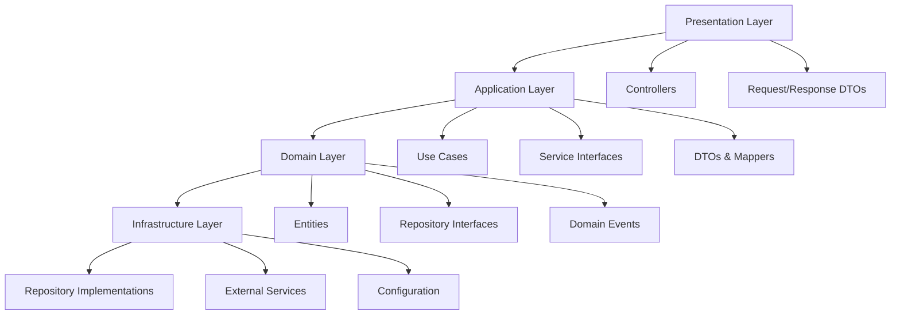
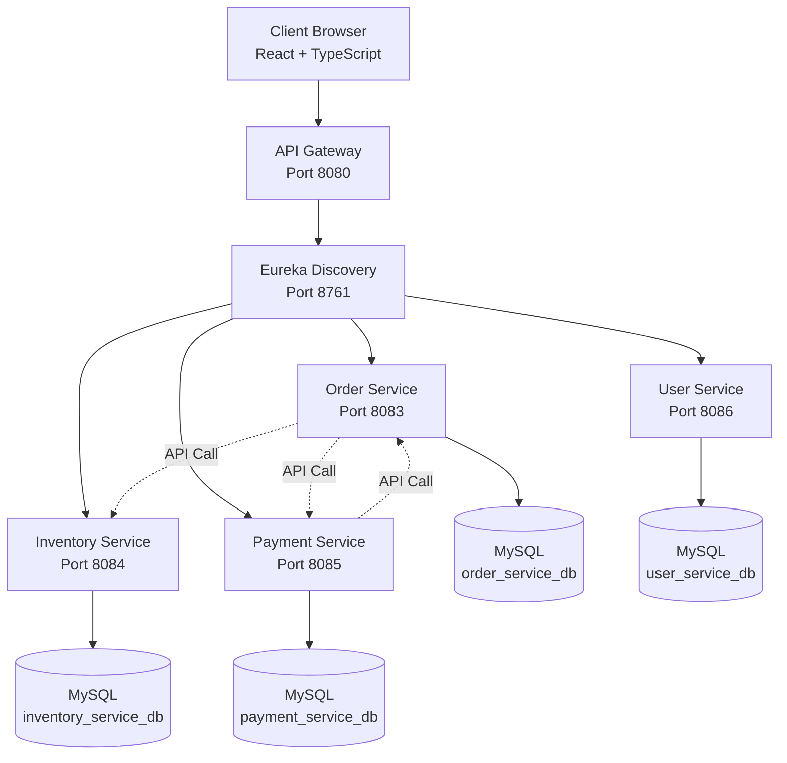
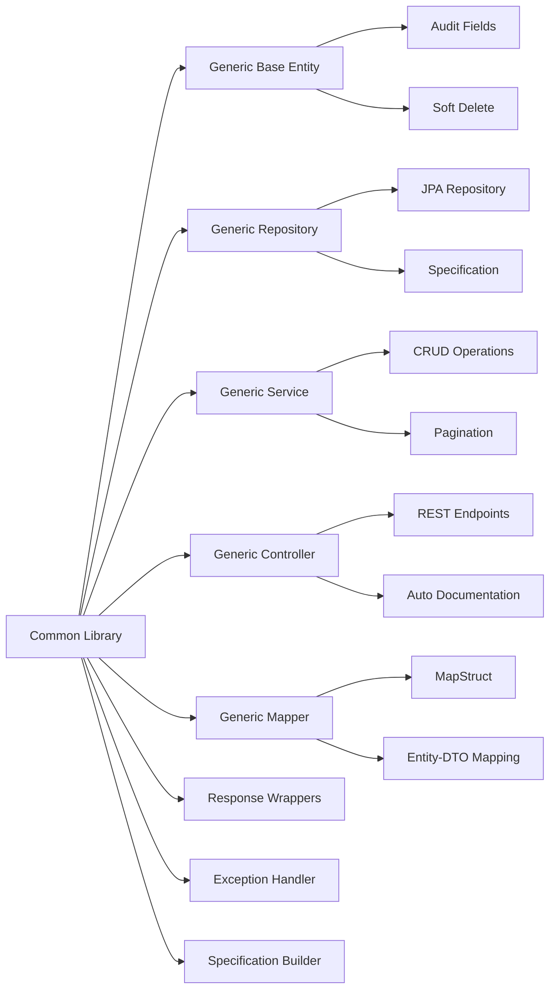

# 🚀 Enterprise Application Suite

<div align="center">


**Enterprise-grade mikroservis mimarisi ile geliştirilmiş, generic yapıda, modern e-ticaret platformu**

**An enterprise-grade e-commerce platform built with microservices architecture, generic structure, and modern technologies**

[⭐ Star](https://github.com/unknown1fsh/enterprise-application-suite) • [🐛 Report Bug](https://github.com/unknown1fsh/enterprise-application-suite/issues) • [💡 Request Feature](https://github.com/unknown1fsh/enterprise-application-suite/issues) • [📖 Documentation](https://github.com/unknown1fsh/enterprise-application-suite/blob/master/ARCHITECTURE.md)

[](https://github.com/unknown1fsh/enterprise-application-suite/stargazers)
[](https://github.com/unknown1fsh/enterprise-application-suite/network/members)
[](https://github.com/unknown1fsh/enterprise-application-suite/issues)
[](https://github.com/unknown1fsh/enterprise-application-suite/pulls)

---

**🇹🇷 [Türkçe](#-türkçe) • [🇬🇧 English](#-english)**

</div>

---

# 🇹🇷 Türkçe

## 📋 İçindekiler

- [Proje Hakkında](#-proje-hakkında)
- [Özellikler](#-özellikler)
- [Teknoloji Stack'i](#-teknoloji-stacki)
- [Mimari](#-mimari)
- [API Dokümantasyonu](#-api-dokümantasyonu)
- [Kurulum](#-kurulum)
- [Kullanım](#-kullanım)
- [Performans ve Ölçeklenebilirlik](#-performans-ve-ölçeklenebilirlik)
- [Güvenlik](#-güvenlik)
- [Deployment](#-deployment)
- [Troubleshooting](#-troubleshooting)
- [SSS (Sık Sorulan Sorular)](#-sss-sık-sorulan-sorular)
- [Roadmap](#-roadmap)
- [Katkıda Bulunma](#-katkıda-bulunma)
- [Lisans](#-lisans)

---

## 🎯 Proje Hakkında

**Enterprise Application Suite**, mikroservis mimarisi kullanılarak geliştirilmiş, enterprise-grade bir e-ticaret platformudur. Proje, generic yapıda tasarlanmış, Domain-Driven Design (DDD) prensiplerine uygun, CQRS pattern'i destekleyen ve modern teknolojilerle geliştirilmiş kapsamlı bir çözümdür.

### 🌟 Projeyi Öne Çıkaran Özellikler

- ✅ **Tam Generic Yapı**: Tüm servisler ortak bir generic library kullanır, kod tekrarı yok
- ✅ **DDD Uyumlu**: Clean Architecture ve Domain-Driven Design prensipleri
- ✅ **Production Ready**: Gerçek projelerde kullanıma hazır, test edilmiş mimari
- ✅ **Modern Stack**: En güncel teknolojiler ve industry best practices
- ✅ **Kapsamlı Dokümantasyon**: Her şey detaylıca açıklanmış
- ✅ **Tam Entegre Frontend**: React + TypeScript ile modern, responsive UI
- ✅ **Mikroservis Mimarisi**: Bağımsız ölçeklenebilir servisler
- ✅ **Service Discovery**: Netflix Eureka ile dinamik servis keşfi
- ✅ **API Gateway**: Tüm servislere tek noktadan erişim
- ✅ **Database per Service**: Her servis kendi veritabanına sahip
- ✅ **Swagger/OpenAPI**: Tüm servisler için interaktif API dokümantasyonu

### 📊 Proje İstatistikleri

- **4 Mikroservis**: Inventory, Order, Payment, User
- **1 Common Library**: Generic yapı için ortak kütüphane
- **1 API Gateway**: Merkezi API yönetimi
- **1 Discovery Server**: Servis keşfi
- **1 Frontend**: React + TypeScript
- **4 Veritabanı**: Her servis için ayrı MySQL veritabanı

---

## ✨ Özellikler

### 🔧 Backend Özellikleri

#### Generic Common Library

Tüm servisler tarafından kullanılan güçlü ortak kütüphane:

- **Generic Base Entity**: Audit fields (createdAt, updatedAt, version, createdBy, updatedBy) ve soft delete desteği
- **Generic Repository**: Soft delete, specification pattern ile dinamik filtreleme, custom query methods
- **Generic Service**: Tam CRUD operasyonları, pagination, filtering, sorting
- **Generic Controller**: Otomatik REST endpoint'leri (POST, PUT, DELETE, GET, SEARCH, COUNT, EXISTS)
- **Generic Mapper**: Entity-DTO dönüşümleri için MapStruct tabanlı mapping
- **Response Wrappers**: Standart API response formatları (ApiResponse, PagedResponse, ErrorResponse)
- **Global Exception Handler**: Merkezi hata yönetimi ve tutarlı error responses
- **Specification Builder**: Dinamik query oluşturma ve filtreleme
- **Custom Validators**: Email ve Phone validasyonları

#### Domain-Driven Design (DDD)

Her mikroservis katmanlı mimariye sahiptir:



#### Mikroservisler

##### 📦 Inventory Service (Port 8084)

- Ürün kataloğu yönetimi
- Stok takibi ve güncelleme
- Ürün arama ve filtreleme
- Kategori yönetimi
- SKU bazlı ürün sorgulama
- Aktif ürün listeleme

##### 🛒 Order Service (Port 8083)

- Sipariş oluşturma ve yönetimi
- Sipariş durumu takibi
- Sipariş öğeleri yönetimi
- Kullanıcı bazlı sipariş sorgulama
- Durum bazlı sipariş filtreleme
- Inventory ve Payment servisleri ile entegrasyon

##### 💳 Payment Service (Port 8085)

- Ödeme işleme ve doğrulama
- Transaction yönetimi
- Çoklu ödeme yöntemi desteği
- Ödeme durumu takibi
- Sipariş bazlı ödeme sorgulama
- Kullanıcı bazlı ödeme geçmişi

##### 👤 User Service (Port 8086)

- Kullanıcı kayıt ve kimlik doğrulama
- Profil yönetimi
- Rol tabanlı erişim kontrolü (RBAC)
- Şifre yönetimi ve güvenlik
- Username ve email bazlı kullanıcı sorgulama
- Kullanıcı varlık kontrolü

#### API Gateway & Service Discovery

##### API Gateway (Port 8080)

- Tüm servislere tek noktadan erişim
- Load balancing
- CORS yönetimi
- Request routing
- Authentication hazır yapılandırma (JWT ready)

##### Eureka Discovery Server (Port 8761)

- Servis kaydı ve keşfi
- Health check monitoring
- Service registry dashboard
- Otomatik servis keşfi

#### Güvenlik ve Dokümantasyon

- **Spring Security**: JWT hazır yapılandırma
- **Swagger/OpenAPI**: Tüm servisler için interaktif API dokümantasyonu
- **CORS Support**: Frontend entegrasyonu için hazır
- **Global Exception Handling**: Merkezi hata yönetimi
- **Password Encryption**: BCrypt ile şifre hashleme

### 🎨 Frontend Özellikleri

- **React 19 + TypeScript 4.9**: Modern, type-safe frontend geliştirme
- **Material-UI (MUI) 7**: Profesyonel, responsive UI component library
- **Redux Toolkit 2**: Merkezi state yönetimi
- **React Router 7**: Client-side routing
- **Axios 1**: HTTP client ile API entegrasyonu
- **Responsive Design**: Mobile-first, tüm cihazlarda mükemmel görünüm
- **Modern Dashboard**: Tüm servislerin durumunu gerçek zamanlı gösteren dashboard
- **Type Safety**: Full TypeScript desteği ile compile-time error checking
- **Real-time Health Monitoring**: Servis durumlarını gerçek zamanlı izleme

---

## 🛠️ Teknoloji Stack'i

### Backend Stack

| Kategori | Teknoloji | Versiyon | Açıklama |
|----------|-----------|----------|----------|
| **Language** | Java | 17 | Modern Java özellikleri (Records, Pattern Matching, Text Blocks) |
| **Framework** | Spring Boot | 3.3.3 | Enterprise application framework |
| **Microservices** | Spring Cloud | 2023.0.3 | Mikroservis araçları |
| **Security** | Spring Security | - | Güvenlik ve yetkilendirme |
| **Discovery** | Netflix Eureka | - | Service discovery |
| **Gateway** | Spring Cloud Gateway | - | API Gateway (WebFlux) |
| **ORM** | Spring Data JPA | - | Veritabanı erişimi |
| **ORM** | Hibernate | - | JPA implementasyonu |
| **Database** | MySQL | 8.0 | İlişkisel veritabanı |
| **Code Generation** | Lombok | - | Boilerplate azaltma |
| **Mapping** | MapStruct | 1.5.5.Final | Entity-DTO mapping (compile-time) |
| **Documentation** | Swagger/OpenAPI | 2.3.0 | API dokümantasyonu |
| **Build Tool** | Maven | 3.6+ | Bağımlılık yönetimi |
| **Validation** | Jakarta Validation | - | Bean validation |

### Frontend Stack

| Kategori | Teknoloji | Versiyon | Açıklama |
|----------|-----------|----------|----------|
| **Library** | React | 19.2.0 | UI library |
| **Language** | TypeScript | 4.9.5 | Type-safe JavaScript |
| **UI Framework** | Material-UI | 7.3.5 | Component library |
| **State Management** | Redux Toolkit | 2.11.0 | Predictable state container |
| **Routing** | React Router | 7.9.6 | Declarative routing |
| **HTTP Client** | Axios | 1.13.2 | Promise-based HTTP client |
| **Build Tool** | React Scripts | 5.0.1 | Create React App |

### DevOps & Tools

| Kategori | Teknoloji | Durum | Açıklama |
|----------|-----------|-------|----------|
| **Containerization** | Docker | Ready | Containerization hazır |
| **Orchestration** | Kubernetes | Ready | K8s manifest hazır |
| **CI/CD** | GitHub Actions | Ready | Pipeline hazır |
| **Monitoring** | Prometheus + Grafana | Ready | Monitoring hazır |
| **Tracing** | Zipkin/Jaeger | Ready | Distributed tracing hazır |
| **Message Queue** | RabbitMQ/Kafka | Ready | Async communication hazır |
| **Caching** | Redis | Ready | Distributed caching hazır |
| **Circuit Breaker** | Resilience4j | Ready | Fault tolerance hazır |

---

## 🏗️ Mimari

### Mikroservis Mimarisi



### Generic Yapı - Common Library

Tüm mikroservisler ortak bir `common-library` kullanır:



### DDD Katmanları

Her mikroservis şu katmanlı yapıya sahiptir:

```
service-name/
├── domain/                          # Domain Layer (Business Logic)
│   ├── entity/                      # Domain entities
│   │   └── EntityName.java
│   └── repository/                  # Repository interfaces
│       └── EntityRepository.java
│
├── application/                     # Application Layer (Use Cases)
│   ├── dto/                         # Data Transfer Objects
│   │   ├── EntityDTO.java
│   │   └── EntityRequestDTO.java
│   ├── service/                     # Service interfaces & implementations
│   │   ├── EntityService.java
│   │   └── EntityServiceImpl.java
│   └── mapper/                      # Entity-DTO mappers
│       └── EntityMapper.java
│
├── infrastructure/                  # Infrastructure Layer (Technical)
│   └── repository/                  # JPA repository implementations
│       └── EntityRepositoryImpl.java
│
└── presentation/                    # Presentation Layer (API)
    └── controller/                  # REST controllers
        └── EntityController.java
```

### Veritabanı Mimarisi

**Database per Service Pattern**: Her mikroservis kendi veritabanına sahip

| Servis | Veritabanı | Açıklama |
|--------|-----------|----------|
| Inventory Service | `inventory_service_db` | Ürün ve stok verileri |
| Order Service | `order_service_db` | Sipariş ve sipariş öğesi verileri |
| Payment Service | `payment_service_db` | Ödeme işlem verileri |
| User Service | `user_service_db` | Kullanıcı ve kimlik doğrulama verileri |

**Özellikler:**
- Her servis kendi veritabanına sahip
- Servisler API üzerinden iletişim kurar, doğrudan veritabanı erişimi yok
- Veritabanı bağımsızlığı
- Ölçeklenebilirlik
- Veri izolasyonu

---

## 📚 API Dokümantasyonu

### Servis Endpoint'leri

#### 📦 Inventory Service (`/inventory/products`)

| Method | Endpoint | Açıklama |
|--------|----------|----------|
| `POST` | `/` | Yeni ürün oluştur |
| `PUT` | `/{id}` | Ürün güncelle |
| `PUT` | `/{id}/stock` | Ürün stok miktarını güncelle |
| `GET` | `/` | Tüm ürünleri listele (pagination destekli) |
| `GET` | `/{id}` | ID ile ürün getir |
| `GET` | `/sku/{sku}` | SKU ile ürün getir |
| `GET` | `/category/{category}` | Kategoriye göre ürünleri getir |
| `GET` | `/search?name={name}` | İsme göre ürün ara |
| `GET` | `/active` | Aktif ürünleri listele |
| `DELETE` | `/{id}` | Ürünü sil (hard delete) |
| `DELETE` | `/{id}/soft` | Ürünü yumuşak sil (soft delete) |
| `POST` | `/search` | Gelişmiş arama (filtreleme, sıralama) |
| `GET` | `/count` | Toplam ürün sayısı |
| `GET` | `/exists/{id}` | Ürün varlık kontrolü |
| `GET` | `/health` | Health check |

#### 🛒 Order Service (`/order/orders`)

| Method | Endpoint | Açıklama |
|--------|----------|----------|
| `POST` | `/` | Sipariş oluştur (OrderDTO ile) |
| `POST` | `/create` | Sipariş oluştur (OrderRequestDTO ile) |
| `PUT` | `/{id}` | Sipariş güncelle |
| `PUT` | `/{id}/status?status={status}` | Sipariş durumunu güncelle |
| `GET` | `/` | Tüm siparişleri listele |
| `GET` | `/{id}` | ID ile sipariş getir |
| `GET` | `/user/{userId}` | Kullanıcıya göre siparişleri getir |
| `GET` | `/status/{status}` | Duruma göre siparişleri getir |
| `GET` | `/{id}/user/{userId}` | ID ve kullanıcı ID ile sipariş getir |
| `DELETE` | `/{id}` | Siparişi sil |
| `DELETE` | `/{id}/soft` | Siparişi yumuşak sil |
| `POST` | `/search` | Gelişmiş arama |
| `GET` | `/count` | Toplam sipariş sayısı |
| `GET` | `/exists/{id}` | Sipariş varlık kontrolü |
| `GET` | `/health` | Health check |

#### 💳 Payment Service (`/payment/payments`)

| Method | Endpoint | Açıklama |
|--------|----------|----------|
| `POST` | `/process` | Ödeme işle |
| `POST` | `/` | Ödeme oluştur |
| `PUT` | `/{id}` | Ödeme güncelle |
| `PUT` | `/{id}/status?status={status}` | Ödeme durumunu güncelle |
| `GET` | `/` | Tüm ödemeleri listele |
| `GET` | `/{id}` | ID ile ödeme getir |
| `GET` | `/order/{orderId}` | Siparişe göre ödemeleri getir |
| `GET` | `/user/{userId}` | Kullanıcıya göre ödemeleri getir |
| `GET` | `/status/{status}` | Duruma göre ödemeleri getir |
| `GET` | `/transaction/{transactionId}` | Transaction ID ile ödeme getir |
| `DELETE` | `/{id}` | Ödemeyi sil |
| `DELETE` | `/{id}/soft` | Ödemeyi yumuşak sil |
| `POST` | `/search` | Gelişmiş arama |
| `GET` | `/count` | Toplam ödeme sayısı |
| `GET` | `/exists/{id}` | Ödeme varlık kontrolü |
| `GET` | `/health` | Health check |

#### 👤 User Service (`/user/users`)

| Method | Endpoint | Açıklama |
|--------|----------|----------|
| `POST` | `/register` | Yeni kullanıcı kaydet |
| `POST` | `/login` | Kullanıcı girişi |
| `POST` | `/` | Kullanıcı oluştur |
| `PUT` | `/{id}` | Kullanıcı güncelle |
| `GET` | `/` | Tüm kullanıcıları listele |
| `GET` | `/{id}` | ID ile kullanıcı getir |
| `GET` | `/username/{username}` | Username ile kullanıcı getir |
| `GET` | `/email/{email}` | Email ile kullanıcı getir |
| `GET` | `/exists/username/{username}` | Username varlık kontrolü |
| `GET` | `/exists/email/{email}` | Email varlık kontrolü |
| `DELETE` | `/{id}` | Kullanıcıyı sil |
| `DELETE` | `/{id}/soft` | Kullanıcıyı yumuşak sil |
| `POST` | `/search` | Gelişmiş arama |
| `GET` | `/count` | Toplam kullanıcı sayısı |
| `GET` | `/exists/{id}` | Kullanıcı varlık kontrolü |
| `GET` | `/health` | Health check |

### Swagger UI Dokümantasyonu

Her servis için Swagger UI dokümantasyonu mevcuttur:

| Servis | Swagger UI URL |
|--------|----------------|
| **Inventory Service** | http://localhost:8084/swagger-ui.html |
| **Order Service** | http://localhost:8083/swagger-ui.html |
| **Payment Service** | http://localhost:8085/swagger-ui.html |
| **User Service** | http://localhost:8086/swagger-ui.html |

### API Örnekleri

#### 1. Ürün Oluşturma

```bash
curl -X POST http://localhost:8080/inventory/products \
  -H "Content-Type: application/json" \
  -d '{
    "name": "Laptop",
    "description": "Yüksek performanslı laptop",
    "price": 9999.99,
    "stockQuantity": 10,
    "category": "Elektronik",
    "sku": "LAP-001"
  }'
```

**Response:**
```json
{
  "success": true,
  "message": "Product created successfully",
  "data": {
    "id": 1,
    "name": "Laptop",
    "description": "Yüksek performanslı laptop",
    "price": 9999.99,
    "stockQuantity": 10,
    "category": "Elektronik",
    "sku": "LAP-001",
    "active": true,
    "createdAt": "2024-01-15T10:30:00",
    "updatedAt": "2024-01-15T10:30:00"
  }
}
```

#### 2. Kullanıcı Kaydı

```bash
curl -X POST http://localhost:8080/user/users/register \
  -H "Content-Type: application/json" \
  -d '{
    "username": "kullanici_adi",
    "email": "email@example.com",
    "password": "sifre123",
    "firstName": "Ad",
    "lastName": "Soyad"
  }'
```

#### 3. Kullanıcı Girişi

```bash
curl -X POST http://localhost:8080/user/users/login \
  -H "Content-Type: application/json" \
  -d '{
    "usernameOrEmail": "kullanici_adi",
    "password": "sifre123"
  }'
```

#### 4. Sipariş Oluşturma

```bash
curl -X POST http://localhost:8080/order/orders/create \
  -H "Content-Type: application/json" \
  -d '{
    "userId": 1,
    "shippingAddress": "İstanbul, Türkiye",
    "billingAddress": "İstanbul, Türkiye",
    "items": [
      {
        "productId": 1,
        "quantity": 2,
        "price": 9999.99
      }
    ]
  }'
```

#### 5. Ödeme İşleme

```bash
curl -X POST http://localhost:8080/payment/payments/process \
  -H "Content-Type: application/json" \
  -d '{
    "orderId": 1,
    "userId": 1,
    "amount": 19999.98,
    "paymentMethod": "CREDIT_CARD",
    "transactionId": "TXN-123456"
  }'
```

#### 6. Gelişmiş Arama (Pagination ve Filtreleme)

```bash
curl -X POST http://localhost:8080/inventory/products/search \
  -H "Content-Type: application/json" \
  -d '{
    "filters": [
      {
        "field": "category",
        "operator": "EQUALS",
        "value": "Elektronik"
      },
      {
        "field": "price",
        "operator": "GREATER_THAN",
        "value": 1000
      }
    ],
    "page": 0,
    "size": 10,
    "sort": {
      "field": "price",
      "direction": "ASC"
    }
  }'
```

---

## 📦 Kurulum

### Gereksinimler

Aşağıdaki yazılımların sisteminizde yüklü olması gerekmektedir:

- ☕ **Java 17** veya üzeri
- 📦 **Maven 3.6+**
- 🗄️ **MySQL 8.0**
- 📱 **Node.js 18+** ve npm
- 🔧 **Git**

### Sistem Gereksinimleri

- **İşletim Sistemi**: Windows 10+, Linux, veya macOS
- **RAM**: Minimum 8GB (16GB önerilir)
- **Disk Alanı**: En az 2GB boş alan
- **Ağ**: Bağımlılıkları indirmek için internet bağlantısı

### Adım 1: Projeyi Klonlayın

```bash
git clone https://github.com/unknown1fsh/enterprise-application-suite.git
cd enterprise-application-suite
```

### Adım 2: Veritabanını Kurun

#### Windows

```bash
setup-databases.bat
```

#### Linux/Mac

```bash
chmod +x setup-databases.sh
./setup-databases.sh
```

#### Manuel Kurulum

```bash
mysql -u root -p12345 < database-setup.sql
```

Bu işlem aşağıdaki veritabanlarını oluşturur:
- `inventory_service_db`
- `order_service_db`
- `payment_service_db`
- `user_service_db`

**Not:** MySQL şifreniz farklıysa, `database-setup.sql` dosyasını düzenleyin veya manuel olarak çalıştırın.

### Adım 3: Common Library'yi Derleyin

Common library diğer servislerin bağımlılığı olduğu için önce derlenmelidir:

```bash
cd common-library
mvn clean install
cd ..
```

### Adım 4: Tüm Servisleri Derleyin

```bash
mvn clean install
```

Bu komut tüm mikroservisleri ve bağımlılıklarını derler.

### Adım 5: Servisleri Başlatın

**ÖNEMLİ**: Servisleri aşağıdaki sırayla başlatın!

#### 1. Discovery Server (Port 8761)

İlk olarak Discovery Server'ı başlatın:

```bash
cd discovery-server
mvn spring-boot:run
```

✅ Başarılı olduğunda: http://localhost:8761 adresini tarayıcıda açın ve Eureka Dashboard'u kontrol edin.

#### 2. API Gateway (Port 8080)

Yeni bir terminal açın:

```bash
cd api-gateway
mvn spring-boot:run
```

#### 3. Mikroservisler

Her servis için yeni bir terminal açın:

**Inventory Service (Port 8084):**
```bash
cd inventory-management-service
mvn spring-boot:run
```

**Order Service (Port 8083):**
```bash
cd order-processing-service
mvn spring-boot:run
```

**Payment Service (Port 8085):**
```bash
cd payment-management-service
mvn spring-boot:run
```

**User Service (Port 8086):**
```bash
cd user-management-service
mvn spring-boot:run
```

### Adım 6: Servis Durumunu Kontrol Edin

Tüm servislerin başarıyla başladığını kontrol etmek için:

1. **Eureka Dashboard**: http://localhost:8761
   - Tüm servislerin "UP" durumunda olduğunu görmelisiniz

2. **Health Check** (opsiyonel):
```bash
curl http://localhost:8084/inventory/products/health
curl http://localhost:8083/order/orders/health
curl http://localhost:8085/payment/payments/health
curl http://localhost:8086/user/users/health
```

### Adım 7: Frontend'i Başlatın

Yeni bir terminal açın:

```bash
cd frontend
npm install
npm start
```

Frontend otomatik olarak http://localhost:3000 adresinde açılacaktır.

---

## 🚀 Kullanım

### Servis URL'leri

| Servis | Doğrudan URL | Gateway Üzerinden | Açıklama |
|--------|--------------|-------------------|----------|
| **Discovery Server** | http://localhost:8761 | - | Eureka Dashboard |
| **API Gateway** | http://localhost:8080 | - | Tüm API'ler için giriş noktası |
| **Inventory Service** | http://localhost:8084 | http://localhost:8080/inventory | Ürün yönetimi |
| **Order Service** | http://localhost:8083 | http://localhost:8080/order | Sipariş yönetimi |
| **Payment Service** | http://localhost:8085 | http://localhost:8080/payment | Ödeme işlemleri |
| **User Service** | http://localhost:8086 | http://localhost:8080/user | Kullanıcı yönetimi |
| **Frontend** | http://localhost:3000 | - | React uygulaması |

### Eureka Dashboard

Tüm servislerin durumunu görüntülemek için:
- **URL**: http://localhost:8761
- Kayıtlı tüm servisleri görüntüleyin
- Servis health status'lerini kontrol edin

### Frontend Kullanımı

1. **Dashboard**: http://localhost:3000
   - Tüm servislerin durumunu gerçek zamanlı görüntüleyin
   - Health check sonuçlarını izleyin
   - İstatistikleri görüntüleyin

2. **Ürünler Sayfası**:
   - Ürün ekleme
   - Ürün listeleme
   - Ürün düzenleme
   - Ürün silme
   - Ürün arama ve filtreleme

3. **Siparişler Sayfası**:
   - Sipariş görüntüleme
   - Sipariş durumu takibi
   - Yeni sipariş oluşturma

---

## ⚡ Performans ve Ölçeklenebilirlik

### Ölçeklenebilirlik Özellikleri

- **Horizontal Scaling**: Her servis bağımsız olarak ölçeklenebilir
- **Database per Service**: Her servis kendi veritabanına sahip, bağımsız ölçeklenebilir
- **Load Balancing**: API Gateway ile otomatik yük dengeleme
- **Service Discovery**: Eureka ile dinamik servis keşfi

### Performans Optimizasyonları

- **Connection Pooling**: HikariCP ile veritabanı bağlantı havuzu
- **Lazy Loading**: JPA lazy loading ile optimize edilmiş sorgular
- **Pagination**: Tüm listeleme işlemlerinde pagination desteği
- **Caching Ready**: Redis entegrasyonu hazır
- **Async Processing**: Async işlemler için hazır yapı

### Önerilen Donanım

| Servis | CPU | RAM | Disk |
|--------|-----|-----|------|
| Discovery Server | 1 Core | 512MB | 1GB |
| API Gateway | 2 Cores | 1GB | 2GB |
| Microservices | 2 Cores | 2GB | 5GB |
| Database | 4 Cores | 4GB | 50GB |

---

## 🔒 Güvenlik

### Mevcut Güvenlik Özellikleri

- **Password Encryption**: BCrypt ile şifre hashleme
- **JWT Ready**: JWT token tabanlı kimlik doğrulama hazır
- **CORS Configuration**: Cross-origin istekler için yapılandırma
- **Input Validation**: Jakarta Validation ile giriş doğrulama
- **SQL Injection Protection**: JPA ile otomatik koruma
- **XSS Protection**: Spring Security ile XSS koruması

### Production Güvenlik Önerileri

- HTTPS kullanımı
- API rate limiting
- JWT token expiration
- Role-based access control (RBAC) tam implementasyonu
- Audit logging
- Security headers

---

## 🚢 Deployment

### Docker Deployment

Tüm servisler Docker containerization için hazırdır. Docker Compose dosyası ile tüm servisleri tek komutla başlatabilirsiniz:

```bash
docker-compose up -d
```

### Kubernetes Deployment

Kubernetes manifest dosyaları hazırdır. Kubernetes cluster'ınıza deploy edebilirsiniz:

```bash
kubectl apply -f k8s/
```

### CI/CD Pipeline

GitHub Actions ile CI/CD pipeline hazırdır:
- Otomatik test çalıştırma
- Docker image oluşturma
- Kubernetes deployment

---

## 🔧 Troubleshooting

### Yaygın Sorunlar ve Çözümleri

#### 1. Port Zaten Kullanımda

**Sorun**: "Port already in use" hatası

**Çözüm**:
```bash
# Windows
netstat -ano | findstr :8080
taskkill /PID <PID> /F

# Linux/Mac
lsof -ti:8080 | xargs kill -9
```

#### 2. Veritabanı Bağlantı Hatası

**Sorun**: "Connection refused" veya "Access denied"

**Çözüm**:
- MySQL servisinin çalıştığını kontrol edin
- Veritabanı kullanıcı adı ve şifresini kontrol edin
- `application.properties` dosyasındaki bağlantı bilgilerini kontrol edin

#### 3. Servis Eureka'ya Kayıt Olmuyor

**Sorun**: Servis Eureka Dashboard'da görünmüyor

**Çözüm**:
- Discovery Server'ın çalıştığını kontrol edin
- Servis `application.properties` dosyasındaki Eureka URL'ini kontrol edin
- Servis adının doğru olduğundan emin olun

#### 4. Maven Build Hatası

**Sorun**: Maven build sırasında hata

**Çözüm**:
```bash
# Java versiyonunu kontrol edin
java -version  # 17 veya üzeri olmalı

# Maven versiyonunu kontrol edin
mvn -version  # 3.6 veya üzeri olmalı

# Temiz build
mvn clean install -U
```

#### 5. Frontend Build Hatası

**Sorun**: npm install veya npm start hatası

**Çözüm**:
```bash
# npm cache temizle
npm cache clean --force

# node_modules sil ve yeniden yükle
rm -rf node_modules
npm install
```

---

## ❓ SSS (Sık Sorulan Sorular)

### Genel Sorular

**S: Bu proje production'da kullanılabilir mi?**
C: Evet, proje production-ready bir mimariye sahiptir. Ancak production'a geçmeden önce güvenlik ayarlarını (JWT, HTTPS) yapılandırmanız önerilir.

**S: Hangi veritabanını kullanabilirim?**
C: Şu anda MySQL kullanılmaktadır. Ancak generic yapı sayesinde PostgreSQL, MongoDB gibi farklı veritabanlarına geçiş yapılabilir.

**S: Frontend olmadan kullanabilir miyim?**
C: Evet, tüm servisler REST API olarak çalışır. Frontend opsiyoneldir.

**S: Yeni bir mikroservis nasıl eklerim?**
C: `common-library`'yi kullanarak yeni bir servis modülü oluşturabilirsiniz. Generic yapı sayesinde minimum kod ile maksimum fonksiyonalite elde edersiniz.

### Teknik Sorular

**S: Generic Controller nasıl çalışır?**
C: Generic Controller, `GenericController<T, ID, DTO>` sınıfından türetilir ve otomatik olarak CRUD endpoint'leri sağlar. Sadece servis katmanını implement etmeniz yeterlidir.

**S: Soft delete nasıl çalışır?**
C: `BaseEntity` sınıfında `deleted` boolean alanı vardır. Soft delete işlemi bu alanı `true` yapar, ancak veriyi veritabanından silmez.

**S: Pagination nasıl kullanılır?**
C: `PageableDTO` ile pagination parametreleri gönderilir. Response olarak `PagedResponse<T>` döner.

---

## 🗺️ Roadmap

### Kısa Vadeli (1-3 Ay)

- [ ] JWT Authentication tam implementasyonu
- [ ] Unit test coverage artırma
- [ ] Integration test ekleme
- [ ] Docker Compose dosyası
- [ ] Kubernetes manifest dosyaları

### Orta Vadeli (3-6 Ay)

- [ ] Distributed Tracing (Zipkin/Jaeger)
- [ ] Circuit Breaker (Resilience4j)
- [ ] Message Queue (RabbitMQ/Kafka)
- [ ] Caching (Redis)
- [ ] Monitoring (Prometheus + Grafana)

### Uzun Vadeli (6-12 Ay)

- [ ] Service Mesh (Istio/Linkerd)
- [ ] GraphQL API
- [ ] WebSocket desteği
- [ ] Multi-tenancy desteği
- [ ] Internationalization (i18n)

---

## 🤝 Katkıda Bulunma

Katkılarınızı bekliyoruz! Bu projeyi geliştirmek için:

1. ⭐ Projeyi yıldızlayın
2. 🍴 Projeyi fork edin
3. 🌿 Yeni bir branch oluşturun (`git checkout -b feature/amazing-feature`)
4. 💾 Değişikliklerinizi commit edin (`git commit -m 'Add amazing feature'`)
5. 📤 Branch'inizi push edin (`git push origin feature/amazing-feature`)
6. 🔄 Pull Request oluşturun

### Katkıda Bulunma Kuralları

- ✅ Kod standartlarına uyun (Google Java Style Guide)
- ✅ Yeni özellikler için test yazın
- ✅ Dokümantasyonu güncelleyin
- ✅ Açıklayıcı commit mesajları kullanın
- ✅ Pull Request'lerde değişikliklerinizi detaylı açıklayın

Detaylı bilgi için [CONTRIBUTING.md](CONTRIBUTING.md) dosyasına bakabilirsiniz.

---

## 📝 Lisans

Bu proje MIT lisansı altında lisanslanmıştır. Detaylar için [LICENSE](LICENSE) dosyasına bakın.

---

## 👥 Yazar

**unknown1fsh**

- GitHub: [@unknown1fsh](https://github.com/unknown1fsh)

---

## 🙏 Teşekkürler

- Spring Boot ekibine harika framework için
- Netflix'e Eureka service discovery için
- Material-UI ekibine React component library için
- Tüm açık kaynak topluluğuna ve katkıda bulunanlara

---

# 🇬🇧 English

## 📋 Table of Contents

- [About the Project](#-about-the-project)
- [Features](#-features)
- [Technology Stack](#-technology-stack)
- [Architecture](#-architecture)
- [API Documentation](#-api-documentation)
- [Installation](#-installation)
- [Usage](#-usage)
- [Performance and Scalability](#-performance-and-scalability)
- [Security](#-security)
- [Deployment](#-deployment)
- [Troubleshooting](#-troubleshooting)
- [FAQ](#-faq)
- [Roadmap](#-roadmap)
- [Contributing](#-contributing)
- [License](#-license)

---

## 🎯 About the Project

**Enterprise Application Suite** is an enterprise-grade e-commerce platform built with microservices architecture. The project is designed with a generic structure, follows Domain-Driven Design (DDD) principles, supports CQRS pattern, and is developed with modern technologies as a comprehensive solution.

### 🌟 Key Features That Make This Project Stand Out

- ✅ **Fully Generic Structure**: All services use a common generic library, eliminating code duplication
- ✅ **DDD Compliant**: Clean Architecture and Domain-Driven Design principles
- ✅ **Production Ready**: Tested architecture ready for real-world use
- ✅ **Modern Stack**: Latest technologies and industry best practices
- ✅ **Comprehensive Documentation**: Everything is thoroughly explained
- ✅ **Fully Integrated Frontend**: Modern, responsive UI with React + TypeScript
- ✅ **Microservices Architecture**: Independently scalable services
- ✅ **Service Discovery**: Dynamic service discovery with Netflix Eureka
- ✅ **API Gateway**: Single entry point for all services
- ✅ **Database per Service**: Each service has its own database
- ✅ **Swagger/OpenAPI**: Interactive API documentation for all services

### 📊 Project Statistics

- **4 Microservices**: Inventory, Order, Payment, User
- **1 Common Library**: Shared library for generic structure
- **1 API Gateway**: Centralized API management
- **1 Discovery Server**: Service discovery
- **1 Frontend**: React + TypeScript
- **4 Databases**: Separate MySQL database for each service

---

## ✨ Features

### 🔧 Backend Features

#### Generic Common Library

Powerful shared library used by all services:

- **Generic Base Entity**: Audit fields (createdAt, updatedAt, version, createdBy, updatedBy) and soft delete support
- **Generic Repository**: Soft delete, dynamic filtering with specification pattern, custom query methods
- **Generic Service**: Full CRUD operations, pagination, filtering, sorting
- **Generic Controller**: Automatic REST endpoints (POST, PUT, DELETE, GET, SEARCH, COUNT, EXISTS)
- **Generic Mapper**: MapStruct-based mapping for Entity-DTO conversions
- **Response Wrappers**: Standard API response formats (ApiResponse, PagedResponse, ErrorResponse)
- **Global Exception Handler**: Centralized error handling and consistent error responses
- **Specification Builder**: Dynamic query building and filtering
- **Custom Validators**: Email and Phone validations

#### Domain-Driven Design (DDD)

Each microservice has a layered architecture:


#### Microservices

##### 📦 Inventory Service (Port 8084)

- Product catalog management
- Stock tracking and updates
- Product search and filtering
- Category management
- SKU-based product querying
- Active product listing

##### 🛒 Order Service (Port 8083)

- Order creation and management
- Order status tracking
- Order items management
- User-based order querying
- Status-based order filtering
- Integration with Inventory and Payment services

##### 💳 Payment Service (Port 8085)

- Payment processing and verification
- Transaction management
- Multiple payment method support
- Payment status tracking
- Order-based payment querying
- User-based payment history

##### 👤 User Service (Port 8086)

- User registration and authentication
- Profile management
- Role-based access control (RBAC)
- Password management and security
- Username and email-based user querying
- User existence checking

#### API Gateway & Service Discovery

##### API Gateway (Port 8080)

- Single entry point for all services
- Load balancing
- CORS management
- Request routing
- Authentication ready configuration (JWT ready)

##### Eureka Discovery Server (Port 8761)

- Service registration and discovery
- Health check monitoring
- Service registry dashboard
- Automatic service discovery

#### Security and Documentation

- **Spring Security**: JWT-ready configuration
- **Swagger/OpenAPI**: Interactive API documentation for all services
- **CORS Support**: Ready for frontend integration
- **Global Exception Handling**: Centralized error management
- **Password Encryption**: Password hashing with BCrypt

### 🎨 Frontend Features

- **React 19 + TypeScript 4.9**: Modern, type-safe frontend development
- **Material-UI (MUI) 7**: Professional, responsive UI component library
- **Redux Toolkit 2**: Centralized state management
- **React Router 7**: Client-side routing
- **Axios 1**: HTTP client for API integration
- **Responsive Design**: Mobile-first, perfect appearance on all devices
- **Modern Dashboard**: Real-time dashboard showing all service statuses
- **Type Safety**: Full TypeScript support with compile-time error checking
- **Real-time Health Monitoring**: Real-time service status monitoring

---

## 🛠️ Technology Stack

### Backend Stack

| Category | Technology | Version | Description |
|----------|-----------|---------|-------------|
| **Language** | Java | 17 | Modern Java features (Records, Pattern Matching, Text Blocks) |
| **Framework** | Spring Boot | 3.3.3 | Enterprise application framework |
| **Microservices** | Spring Cloud | 2023.0.3 | Microservices tools |
| **Security** | Spring Security | - | Security and authorization |
| **Discovery** | Netflix Eureka | - | Service discovery |
| **Gateway** | Spring Cloud Gateway | - | API Gateway (WebFlux) |
| **ORM** | Spring Data JPA | - | Database access |
| **ORM** | Hibernate | - | JPA implementation |
| **Database** | MySQL | 8.0 | Relational database |
| **Code Generation** | Lombok | - | Boilerplate reduction |
| **Mapping** | MapStruct | 1.5.5.Final | Entity-DTO mapping (compile-time) |
| **Documentation** | Swagger/OpenAPI | 2.3.0 | API documentation |
| **Build Tool** | Maven | 3.6+ | Dependency management |
| **Validation** | Jakarta Validation | - | Bean validation |

### Frontend Stack

| Category | Technology | Version | Description |
|----------|-----------|---------|-------------|
| **Library** | React | 19.2.0 | UI library |
| **Language** | TypeScript | 4.9.5 | Type-safe JavaScript |
| **UI Framework** | Material-UI | 7.3.5 | Component library |
| **State Management** | Redux Toolkit | 2.11.0 | Predictable state container |
| **Routing** | React Router | 7.9.6 | Declarative routing |
| **HTTP Client** | Axios | 1.13.2 | Promise-based HTTP client |
| **Build Tool** | React Scripts | 5.0.1 | Create React App |

### DevOps & Tools

| Category | Technology | Status | Description |
|----------|-----------|--------|-------------|
| **Containerization** | Docker | Ready | Containerization ready |
| **Orchestration** | Kubernetes | Ready | K8s manifest ready |
| **CI/CD** | GitHub Actions | Ready | Pipeline ready |
| **Monitoring** | Prometheus + Grafana | Ready | Monitoring ready |
| **Tracing** | Zipkin/Jaeger | Ready | Distributed tracing ready |
| **Message Queue** | RabbitMQ/Kafka | Ready | Async communication ready |
| **Caching** | Redis | Ready | Distributed caching ready |
| **Circuit Breaker** | Resilience4j | Ready | Fault tolerance ready |

---

## 🏗️ Architecture

### Microservices Architecture


### Generic Structure - Common Library

All microservices use a shared `common-library`:


### DDD Layers

Each microservice has the following layered structure:

```
service-name/
├── domain/                          # Domain Layer (Business Logic)
│   ├── entity/                      # Domain entities
│   │   └── EntityName.java
│   └── repository/                  # Repository interfaces
│       └── EntityRepository.java
│
├── application/                     # Application Layer (Use Cases)
│   ├── dto/                         # Data Transfer Objects
│   │   ├── EntityDTO.java
│   │   └── EntityRequestDTO.java
│   ├── service/                     # Service interfaces & implementations
│   │   ├── EntityService.java
│   │   └── EntityServiceImpl.java
│   └── mapper/                      # Entity-DTO mappers
│       └── EntityMapper.java
│
├── infrastructure/                  # Infrastructure Layer (Technical)
│   └── repository/                  # JPA repository implementations
│       └── EntityRepositoryImpl.java
│
└── presentation/                    # Presentation Layer (API)
    └── controller/                  # REST controllers
        └── EntityController.java
```

### Database Architecture

**Database per Service Pattern**: Each microservice has its own database

| Service | Database | Description |
|---------|----------|-------------|
| Inventory Service | `inventory_service_db` | Product and stock data |
| Order Service | `order_service_db` | Order and order item data |
| Payment Service | `payment_service_db` | Payment transaction data |
| User Service | `user_service_db` | User and authentication data |

**Features:**
- Each service has its own database
- Services communicate via APIs, no direct database access
- Database independence
- Scalability
- Data isolation

---

## 📚 API Documentation

### Service Endpoints

#### 📦 Inventory Service (`/inventory/products`)

| Method | Endpoint | Description |
|--------|----------|-------------|
| `POST` | `/` | Create new product |
| `PUT` | `/{id}` | Update product |
| `PUT` | `/{id}/stock` | Update product stock quantity |
| `GET` | `/` | List all products (pagination supported) |
| `GET` | `/{id}` | Get product by ID |
| `GET` | `/sku/{sku}` | Get product by SKU |
| `GET` | `/category/{category}` | Get products by category |
| `GET` | `/search?name={name}` | Search products by name |
| `GET` | `/active` | List active products |
| `DELETE` | `/{id}` | Delete product (hard delete) |
| `DELETE` | `/{id}/soft` | Soft delete product |
| `POST` | `/search` | Advanced search (filtering, sorting) |
| `GET` | `/count` | Get total product count |
| `GET` | `/exists/{id}` | Check product existence |
| `GET` | `/health` | Health check |

#### 🛒 Order Service (`/order/orders`)

| Method | Endpoint | Description |
|--------|----------|-------------|
| `POST` | `/` | Create order (with OrderDTO) |
| `POST` | `/create` | Create order (with OrderRequestDTO) |
| `PUT` | `/{id}` | Update order |
| `PUT` | `/{id}/status?status={status}` | Update order status |
| `GET` | `/` | List all orders |
| `GET` | `/{id}` | Get order by ID |
| `GET` | `/user/{userId}` | Get orders by user ID |
| `GET` | `/status/{status}` | Get orders by status |
| `GET` | `/{id}/user/{userId}` | Get order by ID and user ID |
| `DELETE` | `/{id}` | Delete order |
| `DELETE` | `/{id}/soft` | Soft delete order |
| `POST` | `/search` | Advanced search |
| `GET` | `/count` | Get total order count |
| `GET` | `/exists/{id}` | Check order existence |
| `GET` | `/health` | Health check |

#### 💳 Payment Service (`/payment/payments`)

| Method | Endpoint | Description |
|--------|----------|-------------|
| `POST` | `/process` | Process payment |
| `POST` | `/` | Create payment |
| `PUT` | `/{id}` | Update payment |
| `PUT` | `/{id}/status?status={status}` | Update payment status |
| `GET` | `/` | List all payments |
| `GET` | `/{id}` | Get payment by ID |
| `GET` | `/order/{orderId}` | Get payments by order ID |
| `GET` | `/user/{userId}` | Get payments by user ID |
| `GET` | `/status/{status}` | Get payments by status |
| `GET` | `/transaction/{transactionId}` | Get payment by transaction ID |
| `DELETE` | `/{id}` | Delete payment |
| `DELETE` | `/{id}/soft` | Soft delete payment |
| `POST` | `/search` | Advanced search |
| `GET` | `/count` | Get total payment count |
| `GET` | `/exists/{id}` | Check payment existence |
| `GET` | `/health` | Health check |

#### 👤 User Service (`/user/users`)

| Method | Endpoint | Description |
|--------|----------|-------------|
| `POST` | `/register` | Register new user |
| `POST` | `/login` | User login |
| `POST` | `/` | Create user |
| `PUT` | `/{id}` | Update user |
| `GET` | `/` | List all users |
| `GET` | `/{id}` | Get user by ID |
| `GET` | `/username/{username}` | Get user by username |
| `GET` | `/email/{email}` | Get user by email |
| `GET` | `/exists/username/{username}` | Check username existence |
| `GET` | `/exists/email/{email}` | Check email existence |
| `DELETE` | `/{id}` | Delete user |
| `DELETE` | `/{id}/soft` | Soft delete user |
| `POST` | `/search` | Advanced search |
| `GET` | `/count` | Get total user count |
| `GET` | `/exists/{id}` | Check user existence |
| `GET` | `/health` | Health check |

### Swagger UI Documentation

Swagger UI documentation is available for each service:

| Service | Swagger UI URL |
|--------|----------------|
| **Inventory Service** | http://localhost:8084/swagger-ui.html |
| **Order Service** | http://localhost:8083/swagger-ui.html |
| **Payment Service** | http://localhost:8085/swagger-ui.html |
| **User Service** | http://localhost:8086/swagger-ui.html |

### API Examples

#### 1. Create Product

```bash
curl -X POST http://localhost:8080/inventory/products \
  -H "Content-Type: application/json" \
  -d '{
    "name": "Laptop",
    "description": "High-performance laptop",
    "price": 9999.99,
    "stockQuantity": 10,
    "category": "Electronics",
    "sku": "LAP-001"
  }'
```

**Response:**
```json
{
  "success": true,
  "message": "Product created successfully",
  "data": {
    "id": 1,
    "name": "Laptop",
    "description": "High-performance laptop",
    "price": 9999.99,
    "stockQuantity": 10,
    "category": "Electronics",
    "sku": "LAP-001",
    "active": true,
    "createdAt": "2024-01-15T10:30:00",
    "updatedAt": "2024-01-15T10:30:00"
  }
}
```

#### 2. User Registration

```bash
curl -X POST http://localhost:8080/user/users/register \
  -H "Content-Type: application/json" \
  -d '{
    "username": "username",
    "email": "email@example.com",
    "password": "password123",
    "firstName": "First",
    "lastName": "Last"
  }'
```

#### 3. User Login

```bash
curl -X POST http://localhost:8080/user/users/login \
  -H "Content-Type: application/json" \
  -d '{
    "usernameOrEmail": "username",
    "password": "password123"
  }'
```

#### 4. Create Order

```bash
curl -X POST http://localhost:8080/order/orders/create \
  -H "Content-Type: application/json" \
  -d '{
    "userId": 1,
    "shippingAddress": "Istanbul, Turkey",
    "billingAddress": "Istanbul, Turkey",
    "items": [
      {
        "productId": 1,
        "quantity": 2,
        "price": 9999.99
      }
    ]
  }'
```

#### 5. Process Payment

```bash
curl -X POST http://localhost:8080/payment/payments/process \
  -H "Content-Type: application/json" \
  -d '{
    "orderId": 1,
    "userId": 1,
    "amount": 19999.98,
    "paymentMethod": "CREDIT_CARD",
    "transactionId": "TXN-123456"
  }'
```

#### 6. Advanced Search (Pagination and Filtering)

```bash
curl -X POST http://localhost:8080/inventory/products/search \
  -H "Content-Type: application/json" \
  -d '{
    "filters": [
      {
        "field": "category",
        "operator": "EQUALS",
        "value": "Electronics"
      },
      {
        "field": "price",
        "operator": "GREATER_THAN",
        "value": 1000
      }
    ],
    "page": 0,
    "size": 10,
    "sort": {
      "field": "price",
      "direction": "ASC"
    }
  }'
```

---

## 📦 Installation

### Prerequisites

The following software must be installed on your system:

- ☕ **Java 17** or higher
- 📦 **Maven 3.6+**
- 🗄️ **MySQL 8.0**
- 📱 **Node.js 18+** and npm
- 🔧 **Git**

### System Requirements

- **Operating System**: Windows 10+, Linux, or macOS
- **RAM**: Minimum 8GB (16GB recommended)
- **Disk Space**: At least 2GB free space
- **Network**: Internet connection for downloading dependencies

### Step 1: Clone the Repository

```bash
git clone https://github.com/unknown1fsh/enterprise-application-suite.git
cd enterprise-application-suite
```

### Step 2: Setup Database

#### Windows

```bash
setup-databases.bat
```

#### Linux/Mac

```bash
chmod +x setup-databases.sh
./setup-databases.sh
```

#### Manual Setup

```bash
mysql -u root -p12345 < database-setup.sql
```

This creates the following databases:
- `inventory_service_db`
- `order_service_db`
- `payment_service_db`
- `user_service_db`

**Note:** If your MySQL password is different, edit `database-setup.sql` or run it manually.

### Step 3: Build Common Library

The common library must be built first as other services depend on it:

```bash
cd common-library
mvn clean install
cd ..
```

### Step 4: Build All Services

```bash
mvn clean install
```

This command builds all microservices and their dependencies.

### Step 5: Start Services

**IMPORTANT**: Start services in the following order!

#### 1. Discovery Server (Port 8761)

Start the Discovery Server first:

```bash
cd discovery-server
mvn spring-boot:run
```

✅ When successful: Open http://localhost:8761 in your browser and check the Eureka Dashboard.

#### 2. API Gateway (Port 8080)

Open a new terminal:

```bash
cd api-gateway
mvn spring-boot:run
```

#### 3. Microservices

Open a new terminal for each service:

**Inventory Service (Port 8084):**
```bash
cd inventory-management-service
mvn spring-boot:run
```

**Order Service (Port 8083):**
```bash
cd order-processing-service
mvn spring-boot:run
```

**Payment Service (Port 8085):**
```bash
cd payment-management-service
mvn spring-boot:run
```

**User Service (Port 8086):**
```bash
cd user-management-service
mvn spring-boot:run
```

### Step 6: Check Service Status

To verify all services have started successfully:

1. **Eureka Dashboard**: http://localhost:8761
   - You should see all services in "UP" status

2. **Health Check** (optional):
```bash
curl http://localhost:8084/inventory/products/health
curl http://localhost:8083/order/orders/health
curl http://localhost:8085/payment/payments/health
curl http://localhost:8086/user/users/health
```

### Step 7: Start Frontend

Open a new terminal:

```bash
cd frontend
npm install
npm start
```

Frontend will automatically open at http://localhost:3000.

---

## 🚀 Usage

### Service URLs

| Service | Direct URL | Via Gateway | Description |
|---------|-----------|-------------|-------------|
| **Discovery Server** | http://localhost:8761 | - | Eureka Dashboard |
| **API Gateway** | http://localhost:8080 | - | Entry point for all APIs |
| **Inventory Service** | http://localhost:8084 | http://localhost:8080/inventory | Product management |
| **Order Service** | http://localhost:8083 | http://localhost:8080/order | Order management |
| **Payment Service** | http://localhost:8085 | http://localhost:8080/payment | Payment processing |
| **User Service** | http://localhost:8086 | http://localhost:8080/user | User management |
| **Frontend** | http://localhost:3000 | - | React application |

### Eureka Dashboard

To view the status of all services:
- **URL**: http://localhost:8761
- View all registered services
- Check service health statuses

### Frontend Usage

1. **Dashboard**: http://localhost:3000
   - View real-time status of all services
   - Monitor health check results
   - View statistics

2. **Products Page**:
   - Add products
   - List products
   - Edit products
   - Delete products
   - Search and filter products

3. **Orders Page**:
   - View orders
   - Track order status
   - Create new orders

---

## ⚡ Performance and Scalability

### Scalability Features

- **Horizontal Scaling**: Each service can be scaled independently
- **Database per Service**: Each service has its own database, independently scalable
- **Load Balancing**: Automatic load balancing with API Gateway
- **Service Discovery**: Dynamic service discovery with Eureka

### Performance Optimizations

- **Connection Pooling**: Database connection pooling with HikariCP
- **Lazy Loading**: Optimized queries with JPA lazy loading
- **Pagination**: Pagination support for all listing operations
- **Caching Ready**: Redis integration ready
- **Async Processing**: Ready structure for async operations

### Recommended Hardware

| Service | CPU | RAM | Disk |
|---------|-----|-----|------|
| Discovery Server | 1 Core | 512MB | 1GB |
| API Gateway | 2 Cores | 1GB | 2GB |
| Microservices | 2 Cores | 2GB | 5GB |
| Database | 4 Cores | 4GB | 50GB |

---

## 🔒 Security

### Current Security Features

- **Password Encryption**: Password hashing with BCrypt
- **JWT Ready**: JWT token-based authentication ready
- **CORS Configuration**: Configuration for cross-origin requests
- **Input Validation**: Input validation with Jakarta Validation
- **SQL Injection Protection**: Automatic protection with JPA
- **XSS Protection**: XSS protection with Spring Security

### Production Security Recommendations

- HTTPS usage
- API rate limiting
- JWT token expiration
- Full implementation of role-based access control (RBAC)
- Audit logging
- Security headers

---

## 🚢 Deployment

### Docker Deployment

All services are ready for Docker containerization. You can start all services with a single command using Docker Compose:

```bash
docker-compose up -d
```

### Kubernetes Deployment

Kubernetes manifest files are ready. You can deploy to your Kubernetes cluster:

```bash
kubectl apply -f k8s/
```

### CI/CD Pipeline

CI/CD pipeline ready with GitHub Actions:
- Automatic test execution
- Docker image creation
- Kubernetes deployment

---

## 🔧 Troubleshooting

### Common Issues and Solutions

#### 1. Port Already in Use

**Issue**: "Port already in use" error

**Solution**:
```bash
# Windows
netstat -ano | findstr :8080
taskkill /PID <PID> /F

# Linux/Mac
lsof -ti:8080 | xargs kill -9
```

#### 2. Database Connection Error

**Issue**: "Connection refused" or "Access denied"

**Solution**:
- Check if MySQL service is running
- Check database username and password
- Check connection information in `application.properties` file

#### 3. Service Not Registering with Eureka

**Issue**: Service not appearing in Eureka Dashboard

**Solution**:
- Check if Discovery Server is running
- Check Eureka URL in service `application.properties` file
- Ensure service name is correct

#### 4. Maven Build Error

**Issue**: Error during Maven build

**Solution**:
```bash
# Check Java version
java -version  # Should be 17 or higher

# Check Maven version
mvn -version  # Should be 3.6 or higher

# Clean build
mvn clean install -U
```

#### 5. Frontend Build Error

**Issue**: npm install or npm start error

**Solution**:
```bash
# Clear npm cache
npm cache clean --force

# Delete node_modules and reinstall
rm -rf node_modules
npm install
```

---

## ❓ FAQ

### General Questions

**Q: Can this project be used in production?**
A: Yes, the project has a production-ready architecture. However, it is recommended to configure security settings (JWT, HTTPS) before going to production.

**Q: Which database can I use?**
A: Currently MySQL is used. However, thanks to the generic structure, you can switch to different databases like PostgreSQL, MongoDB.

**Q: Can I use it without the frontend?**
A: Yes, all services work as REST APIs. Frontend is optional.

**Q: How do I add a new microservice?**
A: You can create a new service module using the `common-library`. Thanks to the generic structure, you get maximum functionality with minimum code.

### Technical Questions

**Q: How does Generic Controller work?**
A: Generic Controller extends from `GenericController<T, ID, DTO>` class and automatically provides CRUD endpoints. You only need to implement the service layer.

**Q: How does soft delete work?**
A: The `BaseEntity` class has a `deleted` boolean field. Soft delete operation sets this field to `true`, but does not delete the data from the database.

**Q: How is pagination used?**
A: Pagination parameters are sent with `PageableDTO`. Response returns `PagedResponse<T>`.

---

## 🗺️ Roadmap

### Short Term (1-3 Months)

- [ ] Full JWT Authentication implementation
- [ ] Increase unit test coverage
- [ ] Add integration tests
- [ ] Docker Compose file
- [ ] Kubernetes manifest files

### Medium Term (3-6 Months)

- [ ] Distributed Tracing (Zipkin/Jaeger)
- [ ] Circuit Breaker (Resilience4j)
- [ ] Message Queue (RabbitMQ/Kafka)
- [ ] Caching (Redis)
- [ ] Monitoring (Prometheus + Grafana)

### Long Term (6-12 Months)

- [ ] Service Mesh (Istio/Linkerd)
- [ ] GraphQL API
- [ ] WebSocket support
- [ ] Multi-tenancy support
- [ ] Internationalization (i18n)

---

## 🤝 Contributing

We welcome your contributions! To help improve this project:

1. ⭐ Star the project
2. 🍴 Fork the project
3. 🌿 Create a new branch (`git checkout -b feature/amazing-feature`)
4. 💾 Commit your changes (`git commit -m 'Add amazing feature'`)
5. 📤 Push to the branch (`git push origin feature/amazing-feature`)
6. 🔄 Open a Pull Request

### Contribution Guidelines

- ✅ Follow code standards (Google Java Style Guide)
- ✅ Write tests for new features
- ✅ Update documentation
- ✅ Use descriptive commit messages
- ✅ Explain your changes in detail in Pull Requests

For more details, see the [CONTRIBUTING.md](CONTRIBUTING.md) file.

---

## 📝 License

This project is licensed under the MIT License. See the [LICENSE](LICENSE) file for details.

---

## 👥 Author

**unknown1fsh**

- GitHub: [@unknown1fsh](https://github.com/unknown1fsh)

---

## 🙏 Acknowledgments

- Spring Boot team for the amazing framework
- Netflix for Eureka service discovery
- Material-UI team for React component library
- All open source communities and contributors

---

<div align="center">

**⭐ If you liked this project, don't forget to star it! ⭐**

Made with ❤️ by [unknown1fsh](https://github.com/unknown1fsh)

[](https://github.com/unknown1fsh/enterprise-application-suite/stargazers)
[](https://github.com/unknown1fsh/enterprise-application-suite/network/members)

</div>
